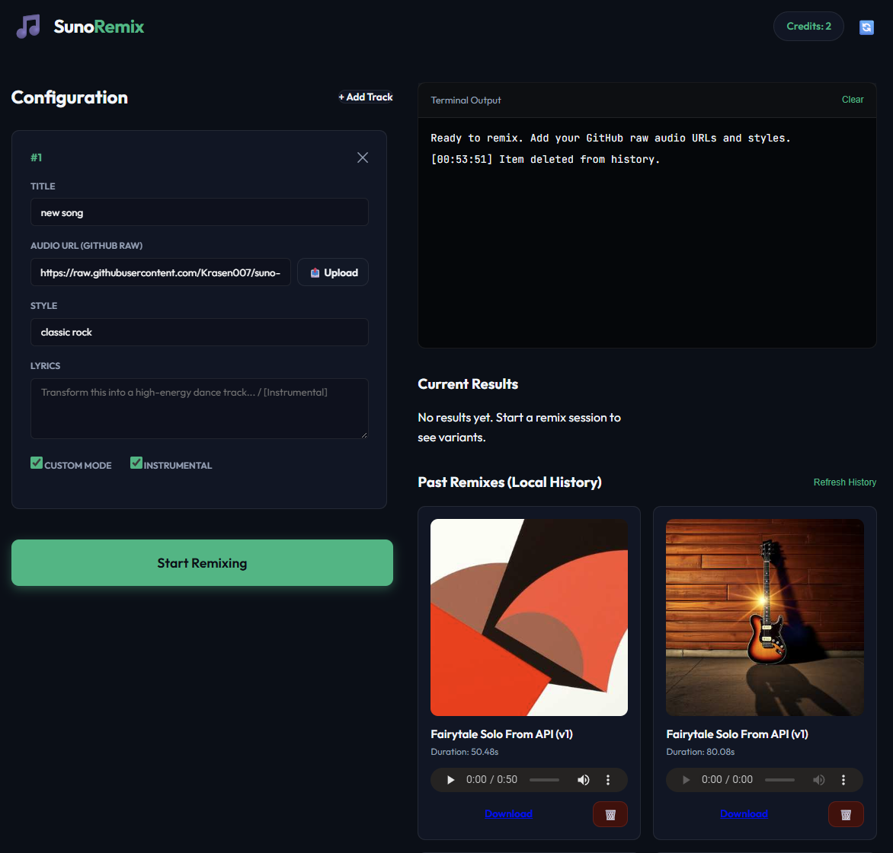

# Suno Remix at Home

A powerful tool to remix your MP3 files using Suno's AI API. Now featuring a modern web interface with localStorage-based persistence, secure API key management, and real-time processing feedback.



## 🚀 Real-World Usage Guide

### 🎯 Quick Start (Recommended)
```bash
# 1. Set up environment
python -m venv .venv

# Linux/macOS
source .venv/bin/activate

# Windows CMD
.venv\Scripts\activate.bat

# Windows PowerShell
.\.venv\Scripts\Activate.ps1

# 2. Install dependencies
pip install -r requirements.txt

# 3. Start the application
python server.py
```

Visit **[http://localhost:5000](http://localhost:5000)** and start using the web interface immediately.

## 🎵 Features

### ✨ Modern Web Interface
- **Clean, responsive design** with dark theme
- **Real-time processing feedback** with live status updates
- **Drag-and-drop support** for audio files (removed - now uses public URLs)
- **Live results display** with audio playback controls
- **Persistent storage** using browser localStorage
- **No server-side dependencies** for API keys

### 🔐 Security & Privacy
- **Browser-only storage** - API keys stored locally, never on server
- **No environment variables** required for API keys
- **Secure API key handling** with input validation
- **Privacy-focused design** - no data sent to external servers

### 🎛️ Core Functionality

#### **Track Management**
- Add multiple tracks with titles, audio URLs, styles, and prompts
- Support for various audio hosting services (Dropbox, Google Drive, personal websites)
- Real-time validation and feedback
- Track removal with confirmation

#### **Remix Processing**
- Real-time SSE (Server-Sent Events) for live updates
- Progress tracking with detailed status messages
- Multiple variant generation per track
- Automatic history saving and management

#### **Results & History**
- Live audio playback with HTML5 controls
- Download links for all generated variants
- Persistent history storage across sessions
- History management with delete functionality
- Cover art display for generated tracks

### 🛠️ Technical Improvements

#### **Enhanced Error Handling**
- **Consistent API error patterns** - All functions return `{data, error}` objects
- **Specific error messages** for common issues (invalid API keys, quota exceeded, etc.)
- **Robust validation** with detailed debugging information
- **Graceful failure handling** with user-friendly messages

#### **Accessibility Features**
- **Proper label associations** for all form fields
- **Keyboard navigation support** with focus management
- **ARIA roles and attributes** for screen readers
- **Focus trapping** in modal dialogs
- **Semantic HTML structure** for better accessibility

#### **Code Quality**
- **Standardized error handling** across all API functions
- **Separated concerns** - Single responsibility per function
- **Removed redundant code** and unreachable logic
- **Enhanced validation** with type checking and edge cases
- **Improved debugging** with comprehensive logging

### 🔧 API Integration

#### **Suno API Features**
- **Credit checking** with real-time balance display
- **Multiple remix styles** (custom mode, instrumental options)
- **Style and prompt controls** for creative direction
- **Direct URL support** for any public hosting service
- **Automatic URL validation** and error handling

#### **Storage & Persistence**
- **Browser localStorage** for API keys and tracks
- **Automatic history merging** between sessions
- **State management** with proper validation
- **Cross-session persistence** of remix results

### 🌐 Hosting Requirements

#### **Audio URL Sources**
Since GitHub upload functionality has been removed, use any public hosting service:

- **Dropbox** - Upload MP3 files and get shareable links
- **Google Drive** - Upload files and set to public access
- **Personal websites** - Host files on your own domain
- **Direct Suno URLs** - Use Suno's temporary URLs directly

#### **URL Format Requirements**
- Must be publicly accessible (no authentication required)
- Direct MP3 file links work best
- HTTPS URLs recommended for security
- No size limits (but consider loading times)

### 🎯 Getting Started

#### **1. API Key Setup**
1. Visit [sunoapi.org](https://sunoapi.org) to get your API key
2. Copy your API key from the account settings
3. Paste the key in the app's API key input
4. Your key is stored locally in your browser only

#### **2. Add Your Tracks**
1. Click "Add Track" to create a new track entry
2. Enter a descriptive title for your remix
3. Paste the public URL to your MP3 file
4. Choose a style (Electronic, Synthwave, Rock, etc.)
5. Add creative prompts or leave blank for AI generation
6. Configure options (custom mode, instrumental)

#### **3. Start Remixing**
1. Click "Start Remixing" to begin processing
2. Watch real-time progress in the terminal output
3. Results appear automatically as they're generated
4. Download your favorite variants

### 🐛️ Troubleshooting

#### **Common Issues & Solutions**

**"No valid tracks" Error**
- Ensure each track has both a title and a public URL
- Check that URLs are accessible (test in incognito browser)
- Verify URL format (https:// required for most hosting)

**"Invalid API Key" Error**
- Double-check your API key from sunoapi.org
- Ensure no extra spaces or characters
- Try refreshing the credits to test connectivity

**"Results Not Showing" Issue**
- Check browser console for any JavaScript errors
- Ensure remix processing completed successfully
- Try refreshing the page if results seem delayed

**Audio Playback Issues**
- Ensure URLs are directly accessible
- Check browser compatibility with audio formats
- Try downloading files if streaming doesn't work

### 🔄 Updates & Changelog

#### **Recent Improvements**
- ✅ **Enhanced error handling** with specific API error messages
- ✅ **Improved accessibility** with proper label associations
- ✅ **Fixed track validation** and state management
- ✅ **Added real-time debugging** for better troubleshooting
- ✅ **Streamlined UI flow** with better user feedback
- ✅ **Removed GitHub dependency** for simplified deployment
- ✅ **Enhanced onboarding** with cleaner welcome flow

#### **Technical Debt Resolved**
- Fixed inconsistent API error handling patterns
- Resolved track state update issues with proper callbacks
- Improved SSE parsing and result processing
- Enhanced form validation and accessibility compliance
- Removed redundant code and unreachable logic paths

---

## 📝️ Requirements

- **Python 3** with modern standard library support (I used 3.14)
- **Modern browser** with ES6 module support
- **Internet connection** for Suno API access
- **Public audio hosting** for source files

## 🤝️ Support

For issues, feature requests, or contributions:
- Check the troubleshooting section above
- Review browser console for detailed error information
- Ensure all URLs are publicly accessible
- Report API connectivity issues to Suno support

---

**Start remixing your music today!** 🎵

### 🔑 API Key Setup (Critical First Step)
**Web Interface**
1. Open http://localhost:5000
2. Click the "Suno API Key" field
3. Paste your Suno API key from [sunoapi.org](https://sunoapi.org)
4. Click "💾 Save" - your key is stored locally in your browser


### 🎵 Audio File Setup

**Any Public Hosting**
1. Upload your MP3/WAV to any public service (Dropbox, Google Drive, personal website, etc.)
2. Copy the public URL
3. Paste in the "Audio URL" field in the web interface

### 🎛️ Important Real-World Notes

#### 💾 Data Management
- **Automatic downloads** protect against expired Suno links (15-day limit)
- **Browser localStorage** provides persistent history across sessions
- **No server files** - everything stays on your local machine
- **Export capability** - your `remixes/` folder contains all downloaded files

### 🎯 Typical Workflow

1. **Start server**: `python server.py`
2. **Open browser**: Navigate to localhost:5000
3. **Enter API key**: First-time setup takes 30 seconds
4. **Add tracks**: Configure multiple songs in one session
5. **Process**: Click "🎵 Start Remix" and watch real-time progress
6. **Access results**: Play immediately, download permanently
7. **History**: All past sessions available in "Past Remixes" tab

### ⚙️ Advanced Configuration
#### Custom Styles (Examples)
```
80s synth, upbeat, high energy
lo-fi hip hop, chill vibes
rock anthem, powerful drums
acoustic folk, storytelling
```

#### Generation Parameters
- **Custom Mode**: Extend/modify existing music
- **Instrumental**: Remove vocals for karaoke/backing tracks
- **Model**: V5 for latest quality

---

## 🛠️ Technical Details

### 📂 Data Storage
- **Browser localStorage**: API keys and history (secure, client-side)
- **Local files**: `remixes/` folder for permanent MP3 storage
- **No server persistence**: Stateless design for privacy and performance

### 🔐 Security Model
- **Client-side keys**: Never transmitted to server logs
- **Session-based auth**: Temporary tokens only during processing
- **HTTPS only**: All API calls use encrypted connections
- **No key exposure**: API keys hidden from browser dev tools

---

**Start using the web interface immediately - it's designed for real-world usage!** 🚀
